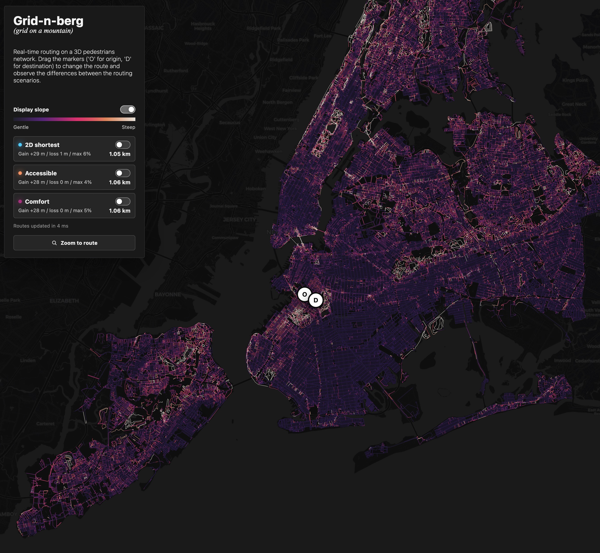

# Gridnberg

> "Grid-and-berg", as in "grid on a hill."

Gridnberg is a topography-aware pedestrian routing dataset, workflow, and web
app for New York City. It takes an existing pedestrian network, assigns local
elevation to its vertices, derives slope-aware routing costs, and demonstrates
how route choice changes when grade is considered.



## Purpose

Gridnberg is meant to make urban spatial analysis more terrain-aware. The project adds elevation, grade, and transparent routing-cost scenarios to an existing NYC
pedestrian network.

## Citation

Please cite both this dataset and the source pedestrian
network.

| Dataset                   | Suggested citation                                                                                                                                                                                                                |
| ------------------------- | --------------------------------------------------------------------------------------------------------------------------------------------------------------------------------------------------------------------------------- |
| Gridnberg                 | Noyman, A. (2026). _Gridnberg: A topography-aware pedestrian routing dataset for New York City_ [Data set and software]. https://arielnoyman.com/gridnberg                                                                        |
| Source pedestrian network | Sevtsuk, A., Basu, R., Liu, L., Alhassan, A., et al. (2026). _Spatial distribution of foot traffic in New York City and applications for urban planning_. _Nature Cities_, 3, 136-145. https://doi.org/10.1038/s44284-025-00383-y |

```bibtex
@dataset{noyman_gridnberg_2026,
  author = {Noyman, A.},
  title = {Gridnberg: A Topography-Aware Pedestrian Routing Dataset for New York City},
  year = {2026},
  type = {Data set and software},
  url = {https://arielnoyman.com/gridnberg}
}
```

## Repository Contents

| Path                                                | Purpose                                                              |
| --------------------------------------------------- | -------------------------------------------------------------------- |
| `outputs/nyc_ped_net_radius50m_routing_network.csv` | Main routing network table. One row per retained pedestrian segment. |
| `outputs/nyc_ped_net_radius50m_routing_nodes.csv`   | Routing node table referenced by the network table.                  |
| `app/`                                              | Static web app demonstrating route comparisons.                      |
| `qgis/gridnberg.qgz`                                | QGIS companion project for inspecting the data spatially.            |
| `qgis/nyc_ped_net_radius50m_routing.gpkg`           | GeoPackage version of the routing network and nodes.                 |
| `scripts/pedestrian_network_height_workflow.ipynb`  | Reproducible workflow for assigning elevation and exporting outputs. |
| `scripts/export_webapp_data.py`                     | Converts the GeoPackage into compact web-app data files.             |

The authoritative public data files are the two CSVs in `outputs/`. The app data
under `app/data/` is generated from the GeoPackage and is optimized for browser
rendering, not for analysis.

## Data Sources

| Source                                     | Use                                                                                                                  | Link                                               |
| ------------------------------------------ | -------------------------------------------------------------------------------------------------------------------- | -------------------------------------------------- |
| NYC pedestrian network from Sevtsuk et al. | Provides the pedestrian network geometry. Gridnberg does not use the source demand or foot-traffic count attributes. | https://www.nature.com/articles/s44284-025-00383-y |
| NYC Planimetric Database `ELEVATION` layer | Provides elevation points used to estimate vertex elevations.                                                        | https://github.com/CityOfNewYork/nyc-planimetrics  |
| U.S. Access Board ADA Chapter 4            | Provides reference grade thresholds used to frame the routing-cost scenarios.                                        | https://www.access-board.gov/ada/chapter/ch04/     |

## Method Summary

| Step                         | Description                                                                                             |
| ---------------------------- | ------------------------------------------------------------------------------------------------------- |
| 1. Prepare inputs            | Use the source pedestrian network in `EPSG:6538` and NYC planimetric elevation points in `EPSG:2263`.   |
| 2. Convert units             | Convert elevation-point XY coordinates and elevation values from US survey feet to meters.              |
| 3. Assign elevation          | For each unique pedestrian-network vertex, average nearby elevation points within a 50 m search radius. |
| 4. Retain supported segments | Keep only segments whose vertices all have local elevation support.                                     |
| 5. Build routing graph       | Store one row per physical segment, with A-to-B and B-to-A costs as attributes.                         |
| 6. Export products           | Write public CSVs, a QGIS GeoPackage, and compact browser data for the app.                             |

The elevation assignment is local (50 m). The workflow avoids using a
distant fallback elevation point because that can create plausible-looking but
incorrect grades.

## Routing Costs

| Scenario      | Fields                                             | Interpretation                                                     |
| ------------- | -------------------------------------------------- | ------------------------------------------------------------------ |
| Distance-only | `cost_distance`                                    | Ordinary shortest path by horizontal distance.                     |
| Comfort       | `cost_slope_a_to_b`, `cost_slope_b_to_a`           | Moderate penalty for uphill, downhill, and steep grades.           |
| Accessible    | `cost_accessible_a_to_b`, `cost_accessible_b_to_a` | Stronger slope-sensitive penalty for users more affected by grade. |

The grade reference points are 5% (`1:20`) and 8.33% (`1:12`). These are useful
accessibility references, but the costs are scenario scores rather than travel
times or compliance labels.

## Output Schema

### `routing_network`

| Field                                              | Description                                               |
| -------------------------------------------------- | --------------------------------------------------------- |
| `segment_id`                                       | Unique segment id.                                        |
| `network_record_number`                            | Link back to the intermediate retained 3D network record. |
| `node_a`, `node_b`                                 | Endpoint node ids matching `routing_nodes.node_id`.       |
| `point_count`                                      | Number of geometry vertices in the segment.               |
| `length_m`                                         | Horizontal segment length in meters.                      |
| `z_a_m`, `z_b_m`                                   | Endpoint elevations in meters.                            |
| `net_change_a_to_b_m`                              | Elevation change from endpoint A to endpoint B.           |
| `avg_grade_a_to_b_pct`                             | Average grade from A to B.                                |
| `max_abs_grade_pct`                                | Largest local grade magnitude after short-step filtering. |
| `cost_distance`                                    | Distance-only routing cost.                               |
| `cost_slope_a_to_b`, `cost_slope_b_to_a`           | Comfort routing costs by direction.                       |
| `cost_accessible_a_to_b`, `cost_accessible_b_to_a` | Accessibility-sensitive routing costs by direction.       |

### `routing_nodes`

| Field     | Description                           |
| --------- | ------------------------------------- |
| `node_id` | Unique routing node id.               |
| `x`, `y`  | Projected coordinates in `EPSG:6538`. |
| `z_m`     | Node elevation in meters.             |

## Limitations

Gridnberg measures running slope along the network geometry. It does not measure:

- cross slope, curb ramps, sidewalk width, surface quality, obstacles, or signal timing;
- construction, snow, legal access, or ADA compliance;
- whether steep segments are real terrain, stairs, ramps, bridges, or data artifacts.

Elevation averages can be noisy near complex infrastructure, and the source
network is assumed to represent walkable geometry. The `accessible` profile is a
slope-aware routing scenario, not an accessibility certification.

## Web App

Run the demo locally:

```sh
python3 -m http.server 4317 --bind 127.0.0.1 --directory app
```

Open:

```text
http://127.0.0.1:4317/
```

Regenerate app data after rebuilding the GeoPackage:

```sh
python3 scripts/export_webapp_data.py
```

The app uses MapLibre GL JS from a pinned CDN version and loads generated data
from `app/data/routing-data.json` and `app/data/network-display.geojson`.

## Rebuilding

The rebuild workflow expects the local source shapefiles to be present:

| Input                         | Role                                |
| ----------------------------- | ----------------------------------- |
| `nyc_ped_net/nyc_ped_net.shp` | Source pedestrian network geometry. |
| `height_pnts/height_pnts.shp` | Source elevation points.            |

Run `scripts/pedestrian_network_height_workflow.ipynb` to rebuild the CSVs and
GeoPackage, then run `python3 scripts/export_webapp_data.py` to refresh the web
app payload.
